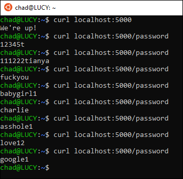

# Testing Azure things.

Creating a simple python service and testing azure things with it. 

`python3 -m venv venv`
`.\venv\Scripts\activate`
`set FLASK_APP=hello.py`
`pip3 -r requirements.txt`

(PowerShell environment variable set: `$env:FLASK_APP = "main.py"`)

Might be gone now, but was deployed to: [https://password-example.azurewebsites.net/](https://password-example.azurewebsites.net/)

Notes: [https://chadduffey.com/2020/06/20/DeployAzureWebservice.html](https://chadduffey.com/2020/06/20/DeployAzureWebservice.html)
